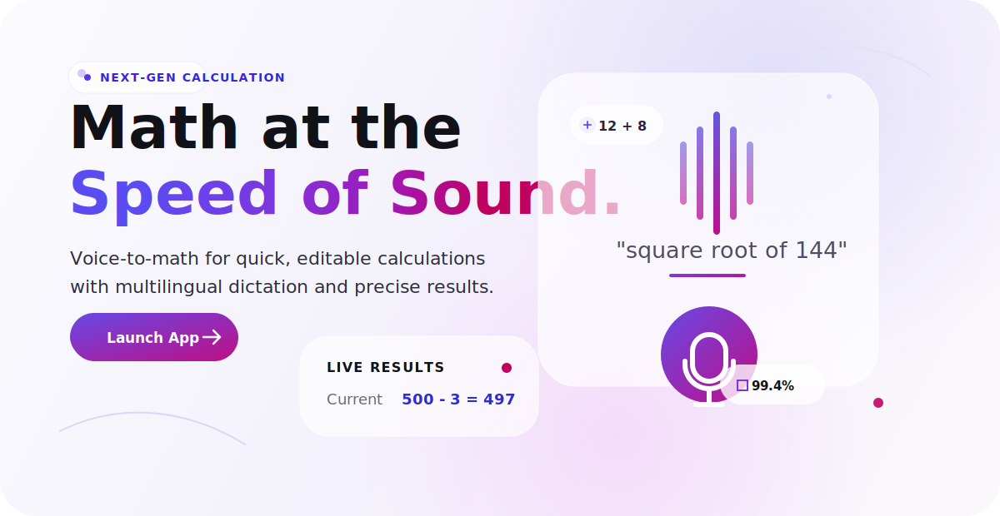

<p align="center">
  <a href="https://grey-neutral.github.io/speech_calculator/">
    
  </a>
</p>

<p align="center">
  <a href="https://grey-neutral.github.io/speech_calculator/">
    
  </a>
  
  
</p>

<h1 align="center">Speech Calc Pro</h1>

<p align="center">
  A sleek, voice-first calculator that turns spoken math into editable equations.
  Dictate, correct, and calculate from one glassy dashboard.
</p>

<p align="center">
  <strong>Live deployment:</strong>
  <a href="https://grey-neutral.github.io/speech_calculator/">https://grey-neutral.github.io/speech_calculator/</a>
</p>

---

## Experience

Speech Calc Pro is built around a simple idea: math should be as fast as saying it out loud.
The interface listens for calculations, turns speech into a normalized editable expression, and updates the result in real time.

The visual direction mirrors the app itself: soft glass panels, quiet shadows, and a purple-to-magenta signal gradient inspired by Apple-style product surfaces.

## Highlights

| Voice-to-math | Editable results | Multilingual dictation |
| --- | --- | --- |
| Record a spoken calculation and keep listening through pauses until you stop. | Edit the purple expression field directly and recalculate live. | Switch dictation language from the top language control. |

| Solid operations | Decimal-safe display | Quick templates |
| --- | --- | --- |
| Supports addition, subtraction, multiplication, division, powers, roots, percentages, factorials, and more. | Long decimals are capped to 4 displayed places so the interface stays clean. | One-tap examples fill the same editable expression field. |

## Design System

| Token | Color | Use |
| --- | --- | --- |
| Deep ink | `#111217` | Headlines and primary text |
| Electric violet | `#5B4CF2` | Active states and brand accents |
| Royal purple | `#7C36DF` | Gradient midpoint |
| Sonic magenta | `#BD0F8F` | Mic button and calls to action |
| Soft glass | `rgba(255, 255, 255, 0.66)` | Dashboard cards |
| Aura mist | `#F3F1FB` | Page atmosphere |

## Run Locally

```bash
npm install
npm run dev
```

Then open:

```text
http://127.0.0.1:5173/
```

## Build

```bash
npm run build
```

The production output is generated in `dist/`.

## Browser Notes

Speech recognition depends on the browser's `SpeechRecognition` or `webkitSpeechRecognition` API.
If a browser does not expose that API, the app still works as a polished manual calculator through the editable purple expression field.

## Project Structure

```text
speech_calculator/
├── assets/
│   └── readme-hero.svg
├── src/
│   ├── main.js
│   └── styles.css
├── index.html
├── package.json
└── README.md
```

<p align="center">
  <strong>Math at the <span>Speed of Sound.</span></strong>
</p>
